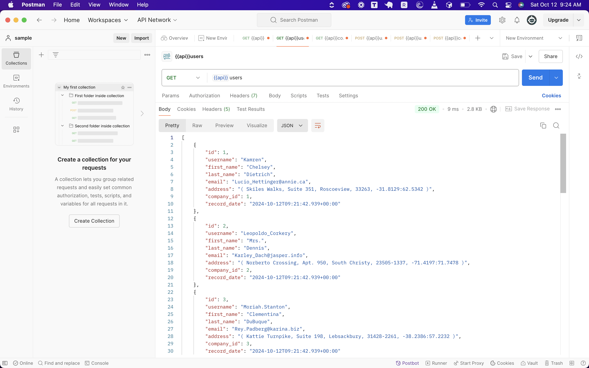
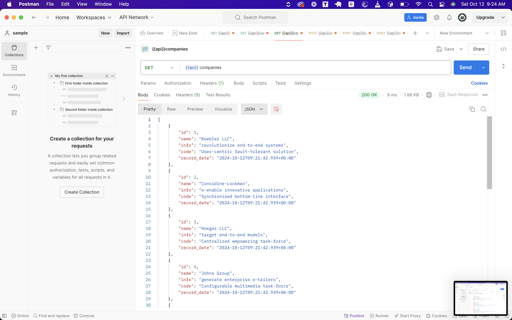
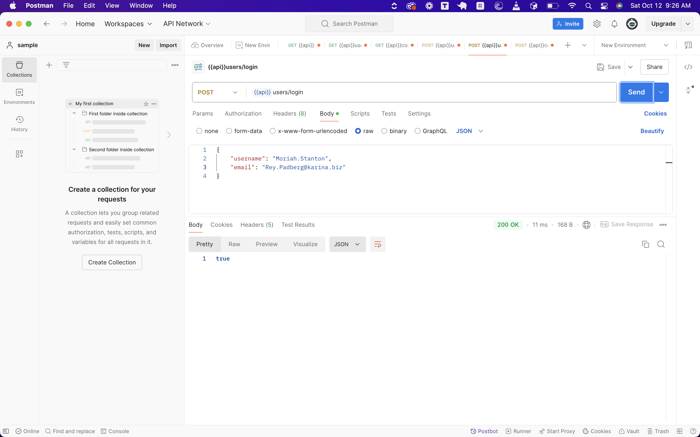
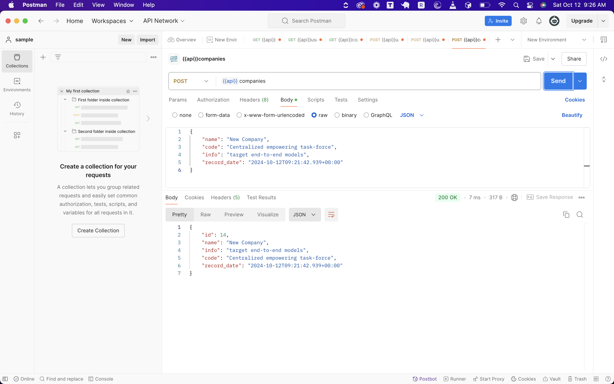
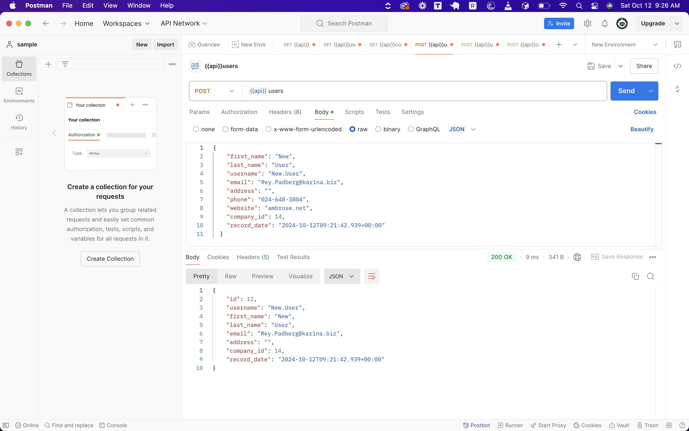
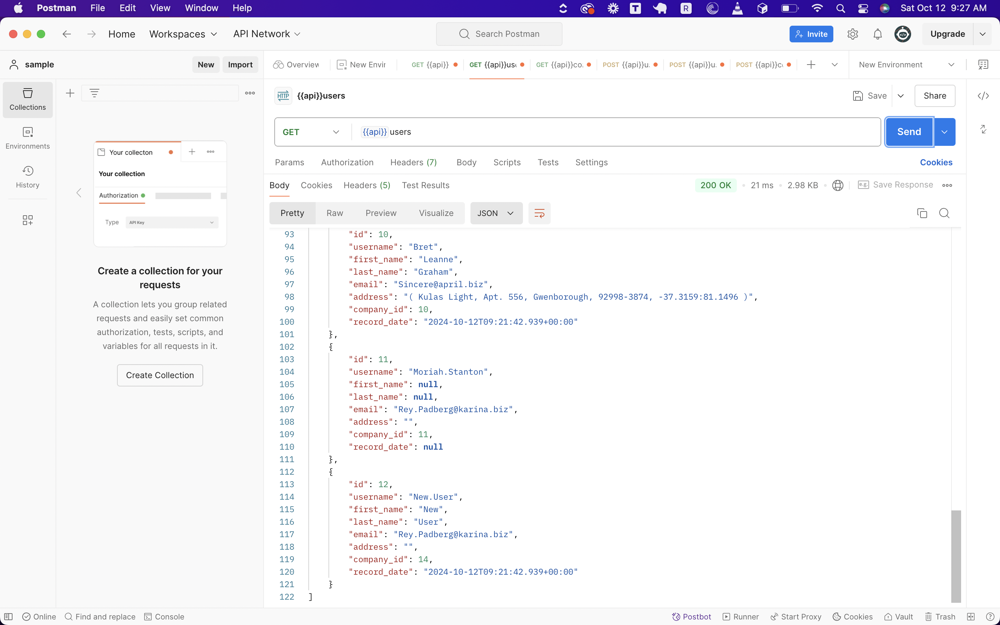
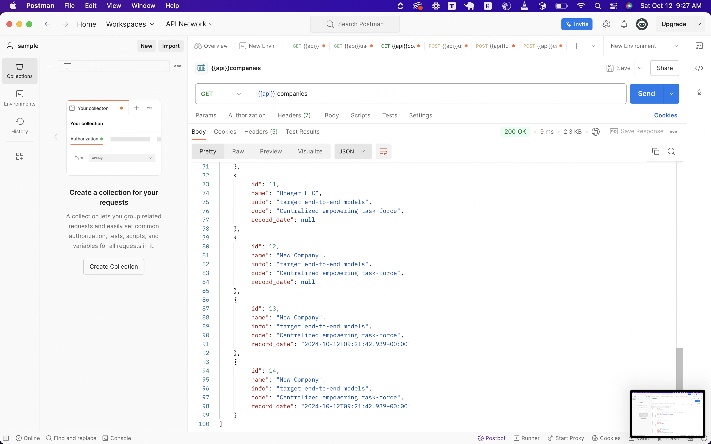

* GET /users

* GET /companies

* POST /users/login - success

* POST /companies

* POST /users with new company's ID

* GET /users with new added user

* GET /companies with new added company

